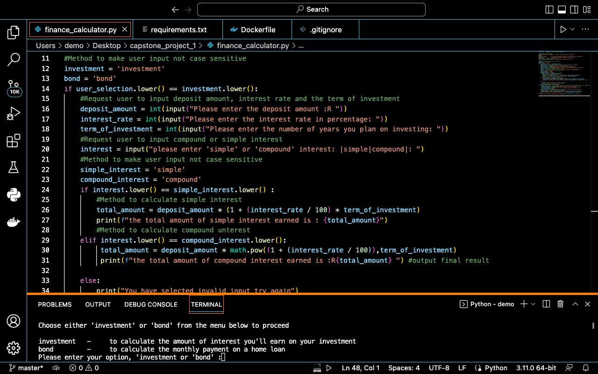
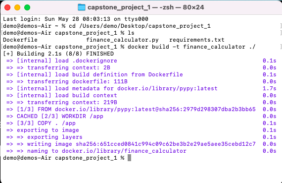
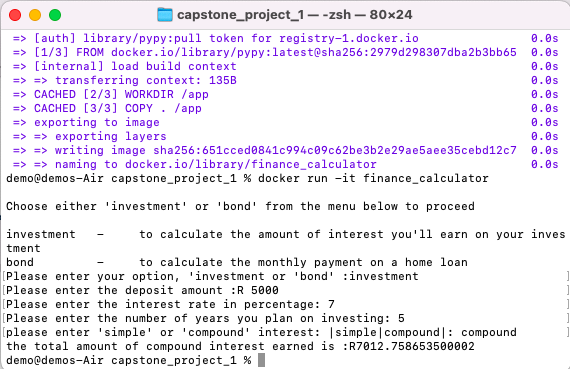

# finance_calculator

This program allows users to calculate the amount of interest on their investments or the monthly payment on a home loan.

## Introduction

The program provides two options: 'investment' and 'bond'. Users can select one of these options to perform the corresponding calculation.

## Installation

1. Clone the repository to your local machine:
```
git clone https://github.com/moeketsisegalo/finance_calculators.git
```
2. Open your preferred integrated development environment (IDE) and import the project.(I recommend VS Code)

3. Ensure that you have Python installed on your system.
4. To run the program from your IDE:

* Open the `finance_calculators.py` file.
* Run the program from your IDE's run or execute command.




Make sure that Python is properly configured in your IDE and that the necessary dependencies are installed.
5.To run the program from the Dockerfile


## Running application from Dockerfile

### Prerequisites

- Docker: Make sure you have Docker installed on your system. You can download Docker from the official website: https://www.docker.com/

1. Clone or download the project repository
2. Open the terminal or command prompt and navigate to the directory where the README.md file is located.
3. Build the Docker image by running the following command in the terminal 
```
docker build -t finance_calculator ./
```

 


4.Once the Docker image is built successfully, you can run the application using the following command:
```
docker run -it finance_calculator
```




## Usage

1. To calculate the interest on your investment:
   - Select the 'investment' option.
   - Enter the deposit amount, interest rate (in percentage), and the number of years for investment.
   - Choose either 'simple' or 'compound' interest.
   - The program will calculate and display the total amount of interest earned.

2. To calculate the monthly payment on a home loan:
   - Select the 'bond' option.
   - Enter the present value of the house, the interest rate (in percentage), and the number of months for repayment.
   - The program will calculate and display the total monthly repayment amount.

Please note that the interest rate should be provided as a percentage, and all monetary amounts are in Rand (R).

## Example

### Calculate Investment Interest

- Deposit amount: R5000
- Interest rate: 7
- Investment term: 5 years
- Interest type: compound

Output:
The total amount of compound interest earned is: R6341.16

### Calculate Bond Monthly Payment

- Present house value: R250000
- Interest rate: 9
- Number of months: 240

Output:
The total monthly repayment amount is: R2463.32


## Credits

Author: Moeketsi Segalo

This project was developed solely by myself, Moeketsi Segalo, using Python. I would like to express my gratitude to HyperionDev for their invaluable teaching and guidance throughout my learning journey. Their courses and resources have played a significant role in enhancing my skills and knowledge in software development.


